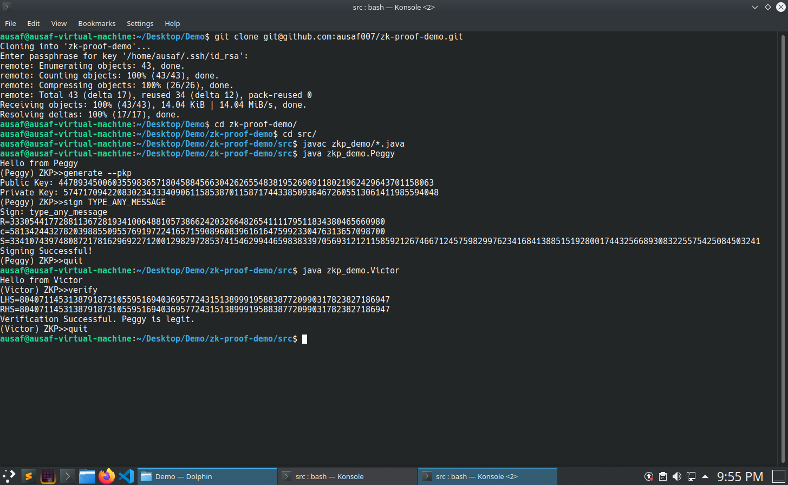

<h1 align="center">Welcome to Zk-Proof Demo 👋</h1>
<p align="center">
  
  <a aria-label="GitHub issues" href="https://github.com/ausaf007/zk-proof-demo/issues" target="_blank">
    
  </a>
  <a aria-label="GitHub license" href="https://github.com/ausaf007/zk-proof-demo/blob/master/LICENSE" target="_blank">
    
  </a>
  <a aria-label="Build Status" target="_blank">
    
  </a>
  <a aria-label="GitHub contributors" href="https://github.com/ausaf007/zk-proof-demo/graphs/contributors" target="_blank">
    
  </a>
  <a aria-label="linkedin-shield" href="https://www.linkedin.com/in/md-ausaf-rashid/" target="_blank">
    
  </a>
</p>

<h3 align="center">Understand the mathematical working of Non-Interactive ZK-Proofs.</h3>

<!-- TABLE OF CONTENTS -->
<details open>
  <summary>Table of Contents</summary>
  <ul>
    <li><a href="#about-the-project">About The Project</a></li>
    <li><a href="#tech-stack">Tech Stack</a></li>
    <li><a href="#prerequisites">Prerequisites</a></li>
    <li><a href="#how to use">How to use?</a></li>
    <li><a href="#license">License</a></li>
  </ul>
</details>

## About The Project

This is a command-line application demonstrating the mathematical working of non-interactive ZK Proofs of discrete log problem. Also called the Schnorr signature scheme.

## Tech Stack

[](https://www.java.com/)

## Prerequisites

Download and install [Java 8 SE Development Kit](https://www.oracle.com/java/technologies/downloads/#java11) (or higher).  

## How To Use?

1. Download the repository or clone it using the bash command:
   ``` 
   git clone https://github.com/ausaf007/zk-proof-demo.git
   ```
2. Navigate to `zk-proof-demo/src/`:
   ``` 
   cd /path/to/repo/zk-proof-demo/src/
   ```
3. Compile all .java programs:
   ``` 
   javac zkp_demo/*.java
   ```
4. **Signing step**: This step is performed by Peggy, who is the prover. Generate public/private key pair, and sign with a message.
   * Run Peggy class:
   ``` 
   java zkp_demo.Peggy
   ```
   * Generate public/private key pair:
   ```
   generate --pkp
   ```
   * Sign the message:
   ```
   sign TYPE_ANY_MESSAGE
   ```
   * Quit from Peggy class:
   ```
   quit
   ```
5. **Proving step**: Verify the Schnorr signature provided by Peggy. This step is performed by Victor, who is the verifier.
   * Run Victor class:
   ``` 
   java zkp_demo.Victor
   ```
   * Verify the message:
   ```
   verify
   ```
   * Quit from Victor class:
   ```
   quit
   ```
6. Thank you for using this application!

## Screenshot



## License
Code released under [MIT License.](https://github.com/ausaf007/zk-proof-demo/blob/master/LICENSE)